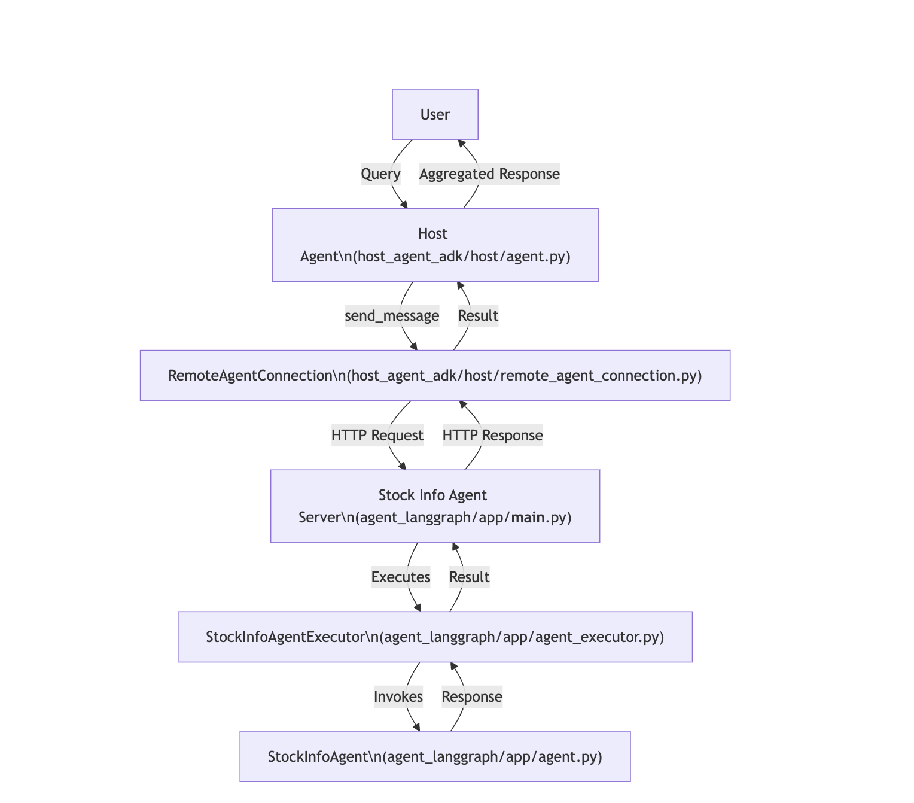

# A2A Agent System – European Stock Market Index Lookup

This project demonstrates a multi-agent system built on the A2A (Agent-to-Agent) protocol. A **Host Agent** (Google ADK) answers questions such as *"How is the German stock market doing?"* by delegating to a **Stock Info Agent** (LangGraph) that fetches **live data from Yahoo Finance** (via `yfinance`) for the main stock market index of 18 European countries (DAX, CAC 40, FTSE 100, IBEX 35, ...).

The two agents use different frameworks and talk only through A2A, which is the point of the project.

---

## Agents Overview

- **Host Agent** (`host_agent_adk`): talks to the user, discovers the Stock Info Agent through its Agent Card, delegates one country per request, and aggregates the answers.
- **Stock Info Agent** (`agent_langgraph`): a LangGraph ReAct agent with one tool, `get_stock_index_by_country`, which returns the latest index value and daily change.
- *(Other agents, e.g. a forecasting or macro-economics agent, can be added by registering their URL.)*

**Supported countries:** Germany, France, Great Britain, Spain, Italy, Netherlands, Belgium, Sweden, Norway, Finland, Denmark, Poland, Switzerland, Austria, Portugal, Greece, Ireland, Hungary. Common aliases (`UK`, `Holland`, lower-case names, ...) are accepted. Czech Republic is not supported because Yahoo Finance has no working symbol for the PX index.

> Values are the latest available close (or live quote) and may be delayed. This is a demo, not financial advice.

---

## Project Structure

```
a2a/
│
├── agent_langgraph/
│   └── app/
│       ├── __main__.py
│       ├── agent.py
│       └── agent_executor.py
│   ├── tests/                      # pytest suite (offline + live)
│   ├── pyproject.toml
│   └── uv.lock
│
├── host_agent_adk/
│   └── host/
│       ├── agent.py
│       └── remote_agent_connection.py
│   ├── tests/                      # pytest suite (fake A2A server)
│   ├── pyproject.toml
│   └── uv.lock
│
├── README.md
├── __init__.py
```

---

## agent_langgraph/app/

### `__main__.py`
- **Purpose:** Entry point for running the Stock Info Agent server (default `localhost:10004`; override with `STOCK_AGENT_HOST` / `STOCK_AGENT_PORT`).
- **What it does:**  
  - Loads environment variables and configures logging.
  - Defines the agent’s capabilities and skills (stock index lookup for European countries).
  - Builds an `AgentCard` (metadata about the agent).
  - Sets up the request handler and task store.
  - Starts a Uvicorn server to serve the agent via HTTP.
- **How it fits:** This file is run to start the agent service, making it available for requests.

---

### `agent.py`
- **Purpose:** Implements the core logic for the Stock Info Agent.
- **What it does:**  
  - Maps each supported country to its main stock index and Yahoo Finance symbol, plus common aliases.
  - Provides a tool (`get_stock_index_by_country`) that fetches the latest value and daily change with `yfinance` (60 s cache, handles incomplete trading days and symbols with sparse history).
  - Defines a `StockInfoAgent` class that:
    - Sets up a language model and tools.
    - Handles queries, streams responses, and formats output.
- **How it fits:** This is the “brain” of the agent, handling user queries and returning market data. Its structured status (`completed` / `input_required` / `error`) drives the A2A task state.

---

### `agent_executor.py`
- **Purpose:** Bridges the agent logic with the A2A server infrastructure.
- **What it does:**  
  - Implements `StockInfoAgentExecutor`, a subclass of `AgentExecutor`.
  - Handles execution of agent tasks:
    - Receives requests, streams responses, updates task state (`working`, `input_required`, `completed`, `failed`), and manages artifacts.
    - Reports agent errors and crashes as `failed` tasks (details stay in the server log).
- **How it fits:** This file connects the agent’s logic to the server, managing the lifecycle of each request.

---

## host_agent_adk/host/

### `agent.py`
- **Purpose:** Implements the Host Agent, which coordinates with the Stock Info Agent.
- **What it does:**  
  - Initializes a connection to the Stock Info Agent (URL from `STOCK_AGENT_URL`, default `http://localhost:10004`).
  - Defines the Host Agent’s instructions and its `send_message` tool.
  - `send_message` keeps a stable `context_id` per conversation, continues a task the remote agent paused with `input_required`, and returns `{status, text}` (`completed`, `input_required`, `failed`, `error`) to the LLM.
  - Provides a synchronous initialization function for use in other contexts.
- **How it fits:** This agent acts as a coordinator, forwarding user queries to the Stock Info Agent and aggregating the results.

---

### `remote_agent_connection.py`
- **Purpose:** Manages the connection to a remote agent.
- **What it does:**  
  - Initializes an HTTP client and an A2A client for communication.
  - Stores the agent card and manages message sending.
- **How it fits:** This is a utility/helper class used by the Host Agent to communicate with the Stock Info Agent.

---

## Other Files

- **`pyproject.toml`, `uv.lock`**: Dependency and environment management for Python projects.
- **`README.md`**: Project-level documentation 
- **`__init__.py`**: Marks directories as Python packages.

---
  
## How Everything Connects

1. **Stock Info Agent** (`agent_langgraph/app/agent.py`) is the core agent that knows how to answer stock queries.
2. **StockInfoAgentExecutor** (`agent_executor.py`) wraps the agent for use with the A2A server.
3. **The server** (`__main__.py`) exposes the agent as a web service.
4. **Host Agent** (`host_agent_adk/host/agent.py`) acts as a coordinator, forwarding queries to the Stock Info Agent.
5. **RemoteAgentConnection** (`remote_agent_connection.py`) is used by the Host Agent to communicate with the Stock Info Agent over HTTP.

---

## Typical Flow

1. **User** asks the Host Agent for stock market index in a European country.
2. **Host Agent** uses `RemoteAgentConnection` to send the query to the Stock Info Agent.
3. **Stock Info Agent** processes the query and returns the result.
4. **Host Agent** aggregates and formats the response for the user.

---


---

## Task, Session, and Message Details

### Session
- **Definition:** A logical grouping of related tasks, typically representing a conversation or workflow.
- **Lifecycle:**
  - Identified by a unique `session_id` (or `context_id`).
  - Maintains state and memory across multiple tasks/queries from the same user or workflow.
  - Enables context-aware responses and continuity.

### Task
- **Definition:** A unit of work representing a user’s request (e.g., "How is the German stock market doing?").
- **Lifecycle:**
  - Created when a user submits a query.
  - Tracked by a unique `task_id`.
  - Can be in states like `pending`, `working`, `input_required`, `completed`, or `error`.
  - May produce artifacts (results) upon completion.

### Message
- **Definition:** The actual content exchanged between user, agents, and services.
- **Types:**
  - User messages (queries, clarifications)
  - Agent messages (responses, requests for more input)
  - Tool messages (results from tools or external services)
- **Structure:**
  - Contains metadata such as sender, role, message ID, task ID, session/context ID, and content (text or structured data).

---


## Setup and Deployment

### Prerequisites

- **uv**: Python package management tool ([installation guide](https://docs.astral.sh/uv/getting-started/installation/))
- **Python 3.12+**: Required by the project.
- **.env file**: Place your Google API Key in a `.env` file in `agent_langgraph/` and `host_agent_adk/`:
  ```
  GOOGLE_API_KEY="your_api_key_here"
  ```
  Optional: `GEMINI_MODEL="gemini-3.5-flash-lite"` selects the Gemini model for both agents. Google retires models from time to time (`gemini-2.0-flash` already is); if you see a `404 ... no longer available` error, list the models your key can use and set a current one here.
- **Quota:** one question costs roughly 5 Gemini calls (the host reasons twice, the stock agent twice, plus its final structured answer). The free tier has small per-model limits (e.g. 20 requests for `gemini-3.8-flash`), so a `429 RESOURCE_EXHAUSTED` error means waiting or switching `GEMINI_MODEL`.

---

## Running the Agents

You will need to run each agent in a separate terminal window.

### Terminal 1: Run Stock Info Agent

```bash
cd agent_langgraph
uv sync
uv run app/__main__.py
```

Start the Stock Info Agent first: the host fetches its Agent Card when it starts.

### Terminal 2: Run Host Agent

```bash
cd host_agent_adk
uv sync
uv run adk web
```

---

## Interacting with the System

- Once all agents are running, you can interact with the Host Agent (e.g., via its web interface or API).
- The Host Agent will forward your queries to the Stock Info Agent and aggregate the results.

---

## Testing

```bash
cd agent_langgraph && uv run pytest -m "not live"   # offline: tool logic + full A2A server flow with a scripted LLM
cd agent_langgraph && uv run pytest -m live          # hits real Yahoo Finance for all 18 countries
cd host_agent_adk  && uv run pytest                  # host agent against a fake A2A server (real HTTP)
```

The offline tests need no API key; the LLM is replaced by a scripted model.

---

## References

- [A2A Python SDK](https://github.com/google/a2a-python)
- [A2A Codelab](https://codelabs.developers.google.com/intro-a2a-purchasing-concierge#1)
- [Youtube Video Ref](https://www.youtube.com/watch?v=mFkw3p5qSuA)

---


